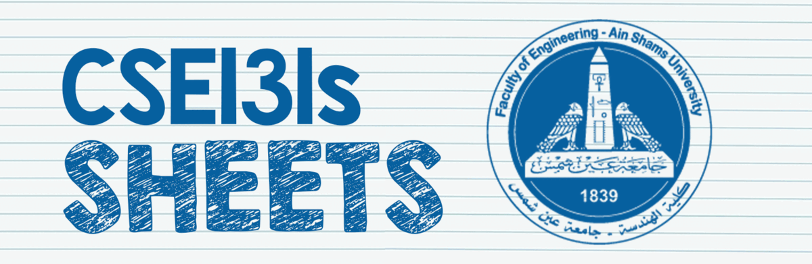

# ASU_Sheets-Solutions
## > **FOE-ASU [CSE131s] / [CSE231s] Problem Sheets + Solutions**

 

## What's included in this repo❓🤔
###  | 📠CSE131s (C++ Programming):
- 📄 [Sheets](https://github.com/dizzydroid/ASU_Sheets-Solutions/tree/main/CSE131s%20Sheets)
- 📝 [Sheet Solutions (PDF)](https://github.com/dizzydroid/ASU_Sheets-Solutions/tree/main/My%20Sheet%20Solutions)
- 👨‍💻 [Source Code](https://github.com/dizzydroid/ASU_Sheets-Solutions/tree/main/Source%20Code)
###  | 📠CSE231s (Java Programming):
- 📄 [Sheets ](https://github.com/dizzydroid/ASU_Sheets-Solutions/tree/main/CSE231s%20-%20Advanced%20Computer%20Programming%20%5BJAVA%5D/%5BCSE231s%5D%20Sheets)
- 📝 [Sheet Solutions (PDF)](https://github.com/dizzydroid/ASU_Sheets-Solutions/tree/main/CSE231s%20-%20Advanced%20Computer%20Programming%20%5BJAVA%5D/My%20Sheet%20Solutions)
- 👨‍💻 [Source Code](https://github.com/dizzydroid/ASU_Sheets-Solutions/tree/main/CSE231s%20-%20Advanced%20Computer%20Programming%20%5BJAVA%5D/Source%20Code)

___________________________________________________________________
### My solutions are not always optimal, far from it actually! Always trust your gut and try it yourself first 💪
#### Feel free to [share](https://github.com/dizzydroid/ASU_Sheets-Solutions/discussions/) your solutions as well, fork &c. 😁
___________________________________________________________________
### **Questions?** Head over to the [discussions](https://github.com/dizzydroid/ASU_Sheets-Solutions/discussions/) tab and fire away!
___________________________________________________________________

<h1 align="center">Thanks for visiting 😊</h1>
